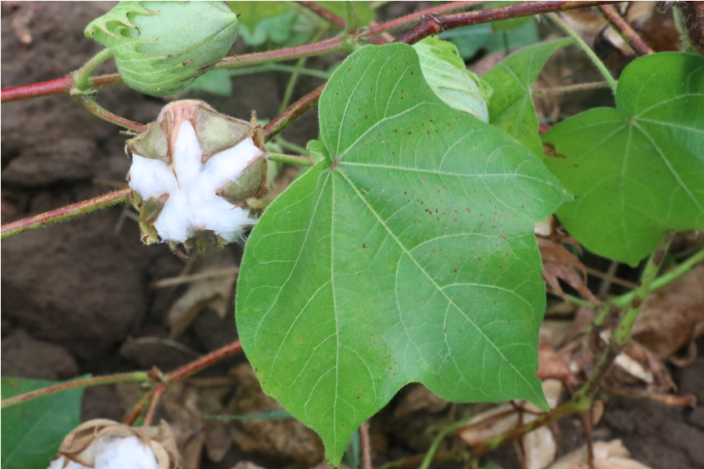
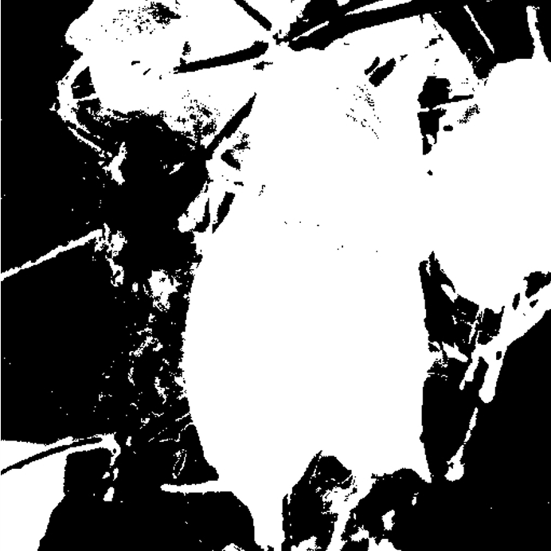
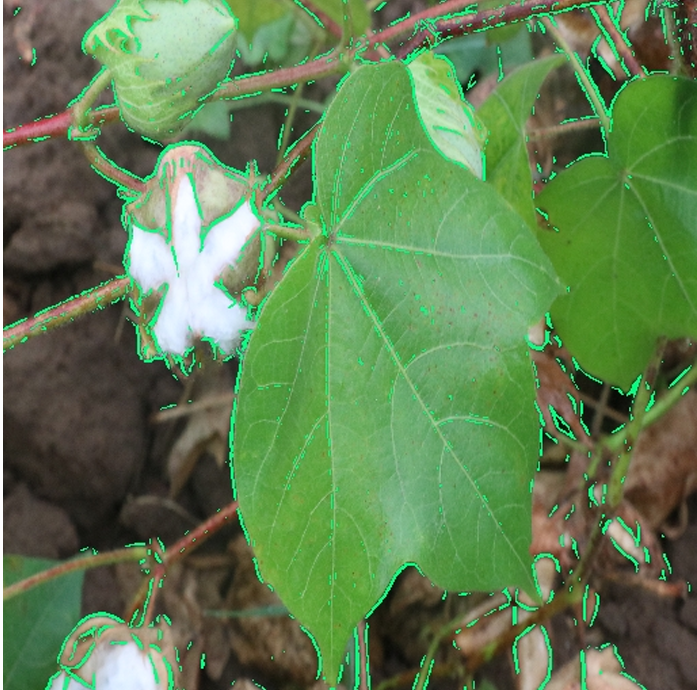
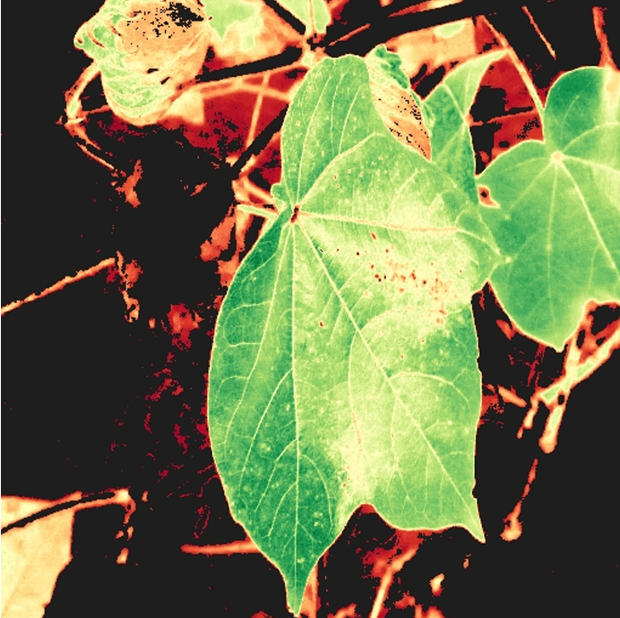

<div align="center">

# 🌿 Leaf Water Stress Detection in Cotton
### A Classical Computer Vision Approach for RGB-Based Plant Stress Analysis


*Turning an ordinary RGB photograph of a cotton leaf into an interpretable estimate of plant water stress.*

</div>

---

## 🌱 Project Overview

Water availability plays a major role in crop health and productivity. Cotton plants are particularly sensitive to changes in water availability, making early identification of water stress an important part of effective crop monitoring.

Conventional approaches for detecting plant stress rely on thermal cameras, multispectral sensors, or laboratory analysis — introducing additional cost and equipment requirements. Manually identifying stress from visual symptoms can be subjective and difficult to scale across large agricultural fields.

This project explores a different direction:

> **Can a standard RGB photograph of a cotton leaf provide enough visual information to estimate its water-stress condition?**

To investigate this, the project implements a classical computer vision pipeline that extracts multiple interpretable characteristics from cotton leaf images. Instead of relying on a black-box deep learning model, the system explicitly analyzes:

```
color → vascular structure → texture → spectral approximation
```

These features are combined into a **Physiological Stress Score (PSS)**, which is subsequently used to estimate stress, visualize stress distribution, and classify the leaf.

---

## 🎯 What This Project Tries to Solve

Imagine a farmer looking at hundreds of cotton plants in a field. Identifying a single stressed leaf visually may be possible — but continuously monitoring a large field becomes increasingly difficult.

| Challenge | Proposed Solution |
|-----------|------------------|
| Manual visual inspection is subjective | Automated CV pipeline |
| Thermal/multispectral sensors are expensive | Standard RGB camera only |
| Large fields are hard to monitor | Scalable image-based analysis |

---

## 🔬 Core Idea

Water stress manifests through multiple visible characteristics of a leaf. A stressed leaf may exhibit changes in:

| Observable Characteristic | Computer Vision Representation |
|--------------------------|-------------------------------|
| 🍃 Green coloration | Excess Green Index (ExG) |
| 🌿 Vascular structure | Frangi Filter / Vein Density |
| 🔍 Surface appearance | Local Binary Pattern (LBP) |
| 🌱 Vegetation characteristics | Simulated NDVI |
| 🧮 Combined physiological indication | Physiological Stress Score (PSS) |
| 🔥 Localized stress | Stress Heatmap |

Rather than depending on a single measurement, the project combines these different characteristics into one analysis pipeline.

---

## 🏗️ System Architecture

```
┌────────────────────┐
│   📷 RGB IMAGE     │
│  Cotton Leaf Input │
└─────────┬──────────┘
          │
          ▼
┌─────────────────────────┐
│ 1. IMAGE PREPROCESSING  │
└────────────┬────────────┘
             │
             ▼
┌─────────────────────────┐
│ 2. LEAF SEGMENTATION    │
└────────────┬────────────┘
             │
    ┌────────┼────────┐
    ▼        ▼        ▼
┌────────┐ ┌────────┐ ┌────────┐
│3. ExG  │ │4.Frangi│ │ 5. LBP │
│ Color  │ │ Veins  │ │Texture │
└───┬────┘ └───┬────┘ └───┬────┘
    └──────────┼──────────┘
               ▼
┌─────────────────────────┐
│ 6. SIMULATED NDVI       │
└────────────┬────────────┘
             │
             ▼
┌─────────────────────────┐
│ 7. PHYSIOLOGICAL        │
│    STRESS SCORE (PSS)   │
└────────────┬────────────┘
             │
             ▼
┌─────────────────────────┐
│ 8. CANOPY TEMPERATURE   │
│    ESTIMATION           │
└────────────┬────────────┘
             │
             ▼
┌─────────────────────────┐
│ 9. STRESS HEATMAP       │
└────────────┬────────────┘
             │
             ▼
┌─────────────────────────┐
│ 10. FINAL CLASSIFICATION│
└────────────┬────────────┘
             │
    ┌────────┼────────┐
    ▼        ▼        ▼
   🟢        🟡        🔴
 HEALTHY    MILD    SEVERE
```

---

## ⚙️ Detailed Methodology

### 01 — Image Preprocessing

Every image first passes through a preprocessing stage to ensure consistent analysis:

- Resized to a standard resolution
- Converted into appropriate formats for processing
- Noise reduction applied
- Lighting inconsistencies adjusted

```
Raw RGB Image → Resize → Format Conversion → Noise/Lighting Handling → Standardized Image
```

### 02 — 🍃 Leaf Segmentation

The background is removed to isolate the leaf using HSV color space:

```
RGB IMAGE → HSV Conversion → Green Pixel Detection → Thresholding → Morphological Operations → 🍃 LEAF MASK
```

### 03 — 🟢 Excess Green Index (ExG)

Healthy leaves exhibit stronger green characteristics due to chlorophyll content. Stressed leaves show yellowing and reduced green intensity. The ExG quantifies the dominance of green color as a stress indicator.

```
Healthy Leaf → Stronger Green Characteristics → ExG Feature → Color-Based Stress Information
```

### 04 — 🌿 Vein Density Using Frangi Filter

Water stress can cause leaves to shrink, making veins more prominent. The **Frangi Vessel Filter** enhances tubular structures, capturing vascular network prominence as a structural stress indicator.

```
Segmented Leaf → Frangi Vessel Filter → Enhanced Vascular Network → Vein Prominence/Density → Structural Stress Indicator
```

### 05 — 🔍 Texture Analysis Using LBP

**Local Binary Patterns (LBP)** capture local texture variations:
- Healthy leaves → Smoother surface characteristics
- Stressed leaves → Rougher / altered texture patterns

### 06 — 🌱 Simulated NDVI

Standard NDVI = **(NIR − Red) / (NIR + Red)**

Since a standard RGB camera does not provide a Near-Infrared channel, this project **mathematically approximates the NIR component using standard RGB channels** — hence "Simulated NDVI." This maintains the low-cost RGB-only design while incorporating spectral information.

> ⚠️ This is an RGB-based approximation, not conventional multispectral NDVI measurement.

### 07 — 🧮 Physiological Stress Score (PSS)

The PSS combines four major feature groups:

```
┌─────────────────────┐
│   COLOR DEGRADATION │
│        (ExG)        │
└──────────┬──────────┘
           │
┌──────────▼──────────┐
│  TEXTURE VARIATION  │
│        (LBP)        │
└──────────┬──────────┘
           │
┌──────────▼──────────┐
│  VEIN PROMINENCE    │
│      (Frangi)       │
└──────────┬──────────┘
           │
┌──────────▼──────────┐
│ SPECTRAL APPROX.    │
│  (Simulated NDVI)   │
└──────────┬──────────┘
           │
           ▼
╔═════════════════════╗
║ PHYSIOLOGICAL       ║
║ STRESS SCORE (PSS)  ║
╚═════════════════════╝
```

### 08 — 🌡️ Canopy Temperature Estimation

Water stress triggers a physiological chain reaction:

```
Water Stress → Stomatal Closure → Reduced Transpiration → Reduced Cooling → Increased Leaf Temperature
```

The current implementation **estimates temperature indirectly from the PSS** rather than using direct thermal imaging.

### 09 — 🔥 Stress Heatmap

A spatial representation of estimated stress over the leaf region:

| Color | Interpretation |
|-------|---------------|
| 🔴 Red | Higher localized stress |
| 🟢 Green | Healthier / turgid region |

### 10 — 🏷️ Final Stress Classification

| Class | Indication |
|-------|-----------|
| 🟢 HEALTHY | No stress |
| 🟡 MILD STRESS | Moderate stress indication |
| 🔴 SEVERE STRESS | High stress indication |

---

## 📷 From Image to Stress Assessment

At the beginning, the system has nothing more than a standard RGB photograph. At the end, it produces three important forms of information:

| Output | Type | Description |
|--------|------|-------------|
| ① Physiological Stress Score | Numerical | A quantified stress value |
| ② Stress Heatmap | Spatial | Visual stress distribution over the leaf |
| ③ Classification | Categorical | Healthy / Mild Stress / Severe Stress |

---

## 📊 Dataset

| Property | Details |
|----------|---------|
| 📦 Total Images | 102 |
| 📷 Image Source | Smartphone Camera |
| 🌤️ Conditions | Natural outdoor conditions |
| 🖼️ Image Type | RGB |
| 🍃 Categories | Healthy / Unhealthy Leaves |

---

## 📈 Results

The complete pipeline was successfully applied to all 102 images:

- ✅ Healthy leaves consistently showed **lower stress scores**
- ✅ Stressed leaves showed **higher vein prominence** and **color degradation**
- ✅ Stress heatmaps clearly highlighted **localized stress regions**
- ✅ Numerical stress scores and heatmaps generated for all analyzed leaves

---

## 💡 Why Classical CV Over Deep Learning?

A major characteristic of this project is **interpretability**. Instead of feeding an image into a black-box model, the pipeline explicitly exposes what characteristics are being analyzed and how they contribute to the final output.

```
LEAF IMAGE
     │
┌────┴────────────────┐
▼         ▼           ▼
🟢 COLOR  🌿 VEINS   🔍 TEXTURE
ExG       Frangi      LBP
     │
     ▼
🌱 Simulated NDVI
     │
     ▼
🧮 Physiological Stress Score
     │
┌────┴────┐
▼         ▼
🔥 Heatmap  🏷️ Classification
```

---

## 💰 Low-Cost Design Philosophy

| Conventional Approach | This Project |
|----------------------|-------------|
| 🌡️ Thermal Imaging | 📱 Standard RGB Camera |
| 🌈 Multispectral Sensors | 🖥️ Classical CV Pipeline |
| 🔬 Specialized Equipment | 🧮 Feature Extraction |
| Higher Cost | Low Cost |

---

## 🛠️ Techniques Used

| Area | Technique |
|------|-----------|
| Image Processing | Preprocessing & Standardization |
| Color Space | HSV |
| Segmentation | Color Thresholding + Morphological Operations |
| Color Feature | Excess Green Index (ExG) |
| Structural Feature | Frangi Vessel Filter |
| Texture Feature | Local Binary Pattern (LBP) |
| Spectral Feature | Simulated NDVI |
| Stress Representation | Physiological Stress Score |
| Temperature | Indirect Canopy Temperature Estimation |
| Visualization | Stress Heatmap |
| Output | Healthy / Mild / Severe Stress |

---

## 📁 Repository Structure

```
leaf_water_stress/
├── README.md
├── LICENSE
├── .gitignore
├── notebooks/
│   └── analysis.ipynb
├── src/
│   ├── preprocessing.py
│   ├── segmentation.py
│   ├── exg.py
│   ├── vein_analysis.py
│   ├── texture_analysis.py
│   ├── ndvi.py
│   ├── stress_score.py
│   ├── temperature_estimation.py
│   ├── heatmap.py
│   └── classification.py
├── results/
│   ├── heatmaps/
│   ├── stress_scores/
│   └── visualizations/
└── docs/
    └── presentation.pdf
```

---

## ⚠️ Limitations

1. **Dataset Size** — 102 images limits generalization across broader environments
2. **RGB Imaging** — Does not directly capture thermal or multispectral information
3. **Simulated NDVI** — NIR is approximated from RGB, not directly measured
4. **Indirect Temperature** — Estimated from PSS, not measured via thermal hardware
5. **Lighting Sensitivity** — Image capture conditions can influence extracted features

---

## 🚀 Future Work

- 🌡️ **Real Thermal Integration** — Direct canopy temperature measurement instead of PSS estimation
- 📦 **Larger Dataset** — More samples, crop varieties, and diverse lighting conditions
- 🚁 **UAV-Based Monitoring** — Extend from individual leaves to field-level aerial stress mapping
- 📱 **Mobile Application** — On-field analysis tool for farmers using smartphone cameras

---

## 🌾 Potential Applications

| Application | Description |
|-------------|-------------|
| 🌱 Crop Monitoring | Identifying visual stress indicators across crops |
| 💧 Irrigation Support | Providing stress data to assist irrigation decisions |
| 📱 Smartphone Analysis | Low-cost field analysis using mobile devices |
| 🚁 UAV Monitoring | Aerial crop monitoring at scale |

---

## 📸 Visual Results

| Original Image | Segmentation | Frangi Filter | Stress Heatmap |
|---------------|--------------|---------------|----------------|
|  |  |  |  |

## 👥 Team — Group 13
**Department of Artificial Intelligence, Amrita Vishwa Vidyapeetham**

| Name | Role |
|------|------|
| Kiran Kumar D | Team Member |
| Manobhiram G | Team Member |
| Ssudier G | Team Member |
| **Gowtham VVS** | Team Member |

---

<div align="center">

🌱 *Built for Exploring Computer Vision in Smart Agriculture*

`RGB` `Computer Vision` `Plant Stress` `Cotton` `Agriculture` `Classical CV` `Interpretable AI`

⭐ If you find this project interesting, consider starring the repository!

</div>
